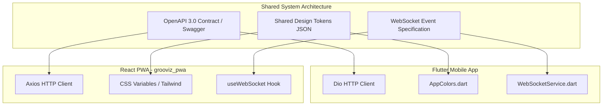

# ScreenSync Mobile System Enhancements & Strategic Roadmap

**Target Project:** ScreenSync Mobile Flutter App (`com.tekchant.screensyncmobileapp`)  
**Scope:** Architectural, Functional, and UX Enhancement Proposals across `lib/pages/`, `lib/services/`, `lib/utils/`, `lib/constants/`  
**Purpose:** Actionable roadmap to improve hotel staff efficiency, guest satisfaction, and long-term system scalability  
**Date:** July 21, 2026  

---

## Executive Overview

This document presents a strategic technical enhancement roadmap for **ScreenSync Mobile**. Rather than focusing on bug remediation, these proposals focus on **operational velocity, real-time collaboration, data visibility, offline resilience, and cross-platform consistency** with the parallel React PWA (`grooviz_pwa`).

Each proposal is anchored directly to observed code constructs (e.g. `HomeService.getTeamPerformance()`, `FoodOrdersPage`, `WebSocketService`, `AlertReloadCoordinator`, `UserSessionHelper`) to ensure immediate feasibility.

---

# 1. UX & Workflow Enhancements

### 1.1 In-Memory Quick Room Search & Smart Filter Bar
* **Observed Code:** [`lib/pages/tasks_page.dart`](file:///d:/grooviz%20Mobile/screen-sync/lib/pages/tasks_page.dart), [`lib/pages/food_orders_page.dart`](file:///d:/grooviz%20Mobile/screen-sync/lib/pages/food_orders_page.dart)
* **Current Limitation:** Filtering is strictly restricted to static department tabs (`All`, `Pending`, `Accepted`, `Completed`, `Escalated`). Staff members cannot search for a specific room (e.g., "Room 402") or guest name without manually scrolling through long lists.
* **Proposed Enhancement:** Add an interactive search header and quick-filter chip row on `TasksPage` and `FoodOrdersPage`. The search bar filters local task lists instantaneously across `roomNumber`, `guestName`, `foodItem`, and `question` fields without initiating extra API calls.

### 1.2 Multi-Select Batch Task Acceptance & Fulfillment
* **Observed Code:** [`lib/pages/tasks_page.dart:180-220`](file:///d:/grooviz%20Mobile/screen-sync/lib/pages/tasks_page.dart), [`lib/services/home_service.dart:491-553`](file:///d:/grooviz%20Mobile/screen-sync/lib/services/home_service.dart#L491-L553)
* **Current Limitation:** Tasks and room service orders must be accepted or updated one at a time (`acceptTask()`, `updateRoomServiceStatus()`), requiring 3–4 taps per request.
* **Proposed Enhancement:** Introduce long-press selection mode on task cards. Housekeeping staff can select 5 towel requests simultaneously and tap a single "Accept Selected" button, executing a batched API mutation payload (`ScreenSync_task_batch_accept_mobile`).

### 1.3 Gesture-Driven Card Actions (Swipe-to-Accept / Swipe-to-Complete)
* **Observed Code:** [`lib/pages/food_orders_page.dart`](file:///d:/grooviz%20Mobile/screen-sync/lib/pages/food_orders_page.dart), [`lib/pages/tasks_page.dart`](file:///d:/grooviz%20Mobile/screen-sync/lib/pages/tasks_page.dart)
* **Current Limitation:** Actions require opening card menus or tapping small button targets on screen cards.
* **Proposed Enhancement:** Wrap task and order list items in Flutter `Dismissible` or custom swipe gesture widgets. 
  * Swipe Right $\rightarrow$ Accept Task / Start Preparing Order (Green background fill).
  * Swipe Left $\rightarrow$ Mark Delivered / Close Task (Blue/Grey background fill).

### 1.4 Optimistic "Undo" Action Banner
* **Observed Code:** [`lib/pages/ticket_details_page.dart`](file:///d:/grooviz%20Mobile/screen-sync/lib/pages/ticket_details_page.dart), [`lib/services/home_service.dart:432-487`](file:///d:/grooviz%20Mobile/screen-sync/lib/services/home_service.dart#L432-L487)
* **Current Limitation:** Tapping "Close Request" or "Mark Delivered" executes `closeServiceRequest()` immediately with no grace period for accidental taps.
* **Proposed Enhancement:** Implement a 5-second floating `SnackBar` with an "Undo" button upon closing a request or changing order status. The network API call is delayed by 5 seconds; if the user taps "Undo", the state modification is reverted locally without touching the server.

---

# 2. Real-Time & Notification Enhancements

### 2.1 Live Presence Guard ("Who's Handling What")
* **Observed Code:** [`lib/services/websocket_service.dart:123-184`](file:///d:/grooviz%20Mobile/screen-sync/lib/services/websocket_service.dart#L123-L184)
* **Current Limitation:** When a `NEW_SERVICE_TASK` or `NEW_FOOD_ORDER` WebSocket message arrives, all staff devices in the department ring simultaneously. Multiple staff members frequently run to the same room or accept the same task.
* **Proposed Enhancement:** Broadcast lightweight WebSocket presence events (`USER_VIEWING_TASK`, `USER_ACCEPTING_TASK`) when a staff member taps into a ticket. Display avatar badges on cards in real-time ("*John is viewing Room 204 request*") to prevent duplicated work.

### 2.2 SLA Visual Countdown Timers & Color Progression
* **Observed Code:** [`lib/pages/home_page.dart:94-96`](file:///d:/grooviz%20Mobile/screen-sync/lib/pages/home_page.dart#L94-L96), [`lib/services/home_service.dart:117-120`](file:///d:/grooviz%20Mobile/screen-sync/lib/services/home_service.dart#L117-L120)
* **Current Limitation:** Tasks display created timestamp string (`_formatTime`), leaving staff to calculate elapsed time and remaining SLA duration manually.
* **Proposed Enhancement:** Parse `timestamp` and `escalation_time_minutes` to render a live countdown chip on task cards (`12:45 remaining`). Color transitions dynamically:
  * **Green:** $>50\%$ SLA remaining.
  * **Orange:** $<25\%$ SLA remaining (Warning).
  * **Pulsing Red:** Overdue / Escalated.

### 2.3 Temporary Alert Snooze Mode
* **Observed Code:** [`lib/services/task_alert_service.dart:42-48`](file:///d:/grooviz%20Mobile/screen-sync/lib/services/task_alert_service.dart#L42-L48), [`lib/services/order_alert_service.dart`](file:///d:/grooviz%20Mobile/screen-sync/lib/services/order_alert_service.dart)
* **Current Limitation:** Foreground alert sounds loop continuously until the pending task count drops to zero (`totalPending == 0`). Staff members talking to guests must either accept the task immediately or mute their phone hardware.
* **Proposed Enhancement:** Add a temporary "Snooze Alerts (5 Min)" option in the app header. Writes a timestamp to `SharedPreferences` that silences alert playback for 5 minutes before automatically re-enabling alerts if tasks remain unresolved.

### 2.4 Smart Rush-Hour Threshold Suggestions
* **Observed Code:** [`lib/services/food_order_service.dart:356-421`](file:///d:/grooviz%20Mobile/screen-sync/lib/services/food_order_service.dart#L356-L421), [`lib/pages/food_orders_page.dart`](file:///d:/grooviz%20Mobile/screen-sync/lib/pages/food_orders_page.dart)
* **Current Limitation:** Kitchen Rush Hour mode must be toggled manually by F&B managers (`setRushHour()`).
* **Proposed Enhancement:** Implement client-side auto-detection: when `FoodOrdersPage` detects $>15$ pending orders within a 10-minute window, display a smart banner prompt: *"High kitchen load detected. Enable 30-min Rush Hour extra prep time?"* with a 1-tap activation button.

---

# 3. Data & Reporting Enhancements

### 3.1 PDF / CSV Export for Checkout Reports & Order Summaries
* **Observed Code:** [`lib/services/checkout_service.dart`](file:///d:/grooviz%20Mobile/screen-sync/lib/services/checkout_service.dart), [`lib/services/food_order_service.dart:425-502`](file:///d:/grooviz%20Mobile/screen-sync/lib/services/food_order_service.dart#L425-L502)
* **Current Limitation:** Checkout reports (`ScreenSync_get_guest_checkout_report_mobile`) and order summaries (`ScreenSync_get_order_summary_mobile`) are viewable on-screen only.
* **Proposed Enhancement:** Integrate `pdf` and `printing` packages to generate branded PDF statements and CSV exports for Front Office cashiers and F&B managers. Allows 1-tap sharing via AirPrint, WhatsApp, or email directly from `GuestCheckoutPage`.

### 3.2 Visual Analytics Charts for Team Performance
* **Observed Code:** [`lib/services/home_service.dart:763-800`](file:///d:/grooviz%20Mobile/screen-sync/lib/services/home_service.dart#L763-L800)
* **Current Limitation:** `getTeamPerformance()` fetches monthly staff metrics (`month`, `year`), but data is presented in basic text tables.
* **Proposed Enhancement:** Implement interactive bar and line charts using `fl_chart` on `ProfilePage` and `HomePage` (for Manager roles). Displays weekly SLA compliance rates, average task resolution time by department, and peak order hours.

### 3.3 Repeated Issue / Room Anomaly Detection
* **Observed Code:** [`lib/services/home_service.dart:696-759`](file:///d:/grooviz%20Mobile/screen-sync/lib/services/home_service.dart#L696-L759)
* **Current Limitation:** `getEscalationHistoryForTask()` tracks audit trails per service request, but there is no cross-ticket analysis per room.
* **Proposed Enhancement:** Add an anomaly detection engine on `HomePage`. If a single room submits $>3$ maintenance requests within 24 hours (e.g. repeated AC or plumbing complaints), flag the room card with an **"Inspect Hardware"** warning badge.

---

# 4. Guest-Facing Enhancements

### 4.1 Real-Time Guest Status Web Link (SMS/WhatsApp Integration)
* **Observed Code:** [`lib/services/food_order_service.dart:224-280`](file:///d:/grooviz%20Mobile/screen-sync/lib/services/food_order_service.dart#L224-L280)
* **Current Limitation:** Status changes (`PREPARING` $\rightarrow$ `READY` $\rightarrow$ `DELIVERED`) are strictly internal to staff devices. Guests have no visibility into order progress.
* **Proposed Enhancement:** When staff update order status via `updateFoodOrderStatus()`, trigger an automated SMS/WhatsApp link to the guest's mobile number (`guest_phone`). Guests open a lightweight web page showing real-time tracker: *"Kitchen Preparing (ETA 15 min)"* $\rightarrow$ *"Out for Delivery"*.

### 4.2 Post-Fulfillment Micro-CSAT Rating Prompt
* **Observed Code:** [`lib/services/home_service.dart:432-487`](file:///d:/grooviz%20Mobile/screen-sync/lib/services/home_service.dart#L432-L487)
* **Current Limitation:** Executing `closeServiceRequest()` closes the ticket internally without recording guest satisfaction metrics.
* **Proposed Enhancement:** Send an automated 1-tap rating SMS (1 to 5 stars) upon closing a request. CSAT scores link back to the resolving staff member's `user_id` and feed directly into `getTeamPerformance()` metrics.

### 4.3 Guest Media Expiration & Rotation Scheduler
* **Observed Code:** [`lib/pages/camera_content_page.dart`](file:///d:/grooviz%20Mobile/screen-sync/lib/pages/camera_content_page.dart), [`lib/services/upload_service.dart`](file:///d:/grooviz%20Mobile/screen-sync/lib/services/upload_service.dart)
* **Current Limitation:** Captured room media is uploaded via `updateGuestPhoto` without expiration settings or display scheduling.
* **Proposed Enhancement:** Add expiration date pickers and auto-delete rules when uploading photos in `CameraContentPage` (e.g., *"Auto-remove guest photo upon room checkout"*).

---

# 5. Reliability & Resilience Enhancements

### 5.1 Offline-First Action Queue (`hive` + `connectivity_plus`)
* **Observed Code:** [`lib/services/login_service.dart`](file:///d:/grooviz%20Mobile/screen-sync/lib/services/login_service.dart), [`lib/services/home_service.dart`](file:///d:/grooviz%20Mobile/screen-sync/lib/services/home_service.dart)
* **Current Limitation:** Staff members walking through Wi-Fi dead zones (elevators, basements, service corridors) receive network error SnackBars when attempting to accept or close tasks.
* **Proposed Enhancement:** Store task status mutations (`acceptTask`, `closeServiceRequest`, `updateFoodOrderStatus`) in a local `Hive` persistent queue when offline. A background synchronization service flushes queued actions sequentially once network connectivity is restored.

### 5.2 Shimmer Skeleton Loaders
* **Observed Code:** [`lib/pages/home_page.dart:218-221`](file:///d:/grooviz%20Mobile/screen-sync/lib/pages/home_page.dart#L218-L221), [`lib/pages/tasks_page.dart`](file:///d:/grooviz%20Mobile/screen-sync/lib/pages/tasks_page.dart)
* **Current Limitation:** Screens display a generic centered `CircularProgressIndicator()` during data fetches, causing abrupt layout pops when data loads.
* **Proposed Enhancement:** Replace generic spinners with layout-matching shimmer placeholders (`shimmer` package) for task cards, summary headers, and order lists.

### 5.3 Direct S3 Pre-Signed URL Photo Uploads
* **Observed Code:** [`lib/services/upload_service.dart`](file:///d:/grooviz%20Mobile/screen-sync/lib/services/upload_service.dart)
* **Current Limitation:** Image uploads transmit raw base64-encoded strings inside JSON POST request bodies to AWS Lambda (`ScreenSync_update_guest_photo_from_mobile`), causing heavy payload overhead and Lambda timeout risks on high-res photos.
* **Proposed Enhancement:** Request short-lived pre-signed AWS S3 upload URLs from the backend. Upload compressed images directly from Flutter to S3 via HTTP `PUT`, bypassing API Gateway size limits.

---

# 6. Platform & Technical Enhancements

### 6.1 State Management Migration (Riverpod / BLoC)
* **Observed Code:** [`lib/pages/home_page.dart`](file:///d:/grooviz%20Mobile/screen-sync/lib/pages/home_page.dart) (1,922 lines), [`lib/pages/food_orders_page.dart`](file:///d:/grooviz%20Mobile/screen-sync/lib/pages/food_orders_page.dart) (1,850+ lines)
* **Current Limitation:** Business logic, periodic timers, API calls, and layout rendering are tightly coupled inside massive `StatefulWidget` classes using ad-hoc `setState()`.
* **Proposed Enhancement:** Extract state management into `Riverpod` or `Bloc` providers (e.g. `TaskListNotifier`, `FoodOrderNotifier`, `SessionProvider`), decoupling UI rendering from state mutations and enabling comprehensive unit testing.

### 6.2 Strongly-Typed Data Models (`freezed` / `json_serializable`)
* **Observed Code:** [`lib/services/food_order_service.dart:110-131`](file:///d:/grooviz%20Mobile/screen-sync/lib/services/food_order_service.dart#L110-L131), [`lib/services/home_service.dart:94-126`](file:///d:/grooviz%20Mobile/screen-sync/lib/services/home_service.dart#L94-L126)
* **Current Limitation:** Services pass raw `Map<String, dynamic>` maps across the app, accessing values via string keys (`m["order_request_id"]`, `t["status"]`), leading to typos and null safety hazards.
* **Proposed Enhancement:** Generate immutable, strongly-typed model classes (`ServiceTask`, `FoodOrder`, `UserProfile`) using `freezed` and `json_serializable` with strict compile-time null safety.

### 6.3 Telemetry & Crash Reporting (Sentry / Firebase Crashlytics)
* **Observed Code:** [`lib/main.dart:35-82`](file:///d:/grooviz%20Mobile/screen-sync/lib/main.dart#L35-L82)
* **Current Limitation:** Unhandled exceptions and WebSocket disconnect errors are logged to `print()` without centralized error tracking in production.
* **Proposed Enhancement:** Integrate Firebase Crashlytics and Sentry to log non-fatal exceptions, API failure rates, and background service crashes automatically across devices.

---

# 7. Cross-Platform Consistency (`grooviz_pwa` Alignment)

As a React PWA (`grooviz_pwa`) is developed in parallel, the following architectural standards should be established to prevent codebase drift:

### 7.1 Shared OpenAPI 3.0 / Swagger Contract
* **Alignment Goal:** Standardize backend request/response structures between Flutter Mobile and React PWA.
* **Action:** Define a single OpenAPI 3.0 specification for all REST endpoints (`/ScreenSync_login_mobile`, `/ScreenSync_get_tasks_mobile`) and a shared WebSocket payload schema (`RUSH_HOUR_UPDATED`, `ESCALATION_ALERT`).

### 7.2 Design Token System Synchronization
* **Alignment Goal:** Maintain identical visual brand identity across mobile app and web dashboard.
* **Action:** Export a central `tokens.json` file defining primary colors, status indicators, border radii, and font scales:
  * Primary: `#1E3A8A`
  * Pending: `#1976D2`
  * Preparing: `#FF9800`
  * Ready: `#4CAF50`
  * Escalated: `#D32F2F`
  Map `tokens.json` to `AppColors` in Flutter ([`app_colors.dart`](file:///d:/grooviz%20Mobile/screen-sync/lib/utils/app_colors.dart)) and CSS variables in React PWA (`--color-primary`, `--color-pending`).

### 7.3 Unified Department Routing & Role Mapping Matrix
* **Alignment Goal:** Ensure identical access control rules across platforms.
* **Action:** Synchronize department-to-tab navigation logic ([`lib/pages/main_navigation.dart:84-100`](file:///d:/grooviz%20Mobile/screen-sync/lib/pages/main_navigation.dart#L84-L100)) with React router guards so staff see identical features regardless of device choice.

---

# 8. Effort vs Impact Matrix & Top Quick Wins

### 🏆 Top 5 "Quick Wins" (Immediate High Value)
1. **Quick Room Number Search & Filter Bar** (*High Impact, Small Effort*): Instant client-side search across active tasks and orders.
2. **SLA Visual Countdown Timers** (*High Impact, Small Effort*): Live color-coded SLA countdown chips on task cards.
3. **Optimistic "Undo" Action Banner** (*High Impact, Small Effort*): 5-second grace period for accidental ticket closures.
4. **Shimmer Skeleton Loading Screens** (*High Impact, Small Effort*): Replaces plain loading spinners with smooth layout skeletons.
5. **Cross-Platform Design Token Synchronization** (*High Impact, Small Effort*): Unifies status colors between Flutter and React PWA.

---

### Complete Roadmap Matrix

| Proposal ID | Enhancement Name | Category | Impact | Effort | Priority |
| :--- | :--- | :--- | :--- | :--- | :--- |
| **UX-1.1** | Quick Room Search & Filter Bar | UX / Workflow | **High** | **Small** | 🏆 Quick Win #1 |
| **RT-2.2** | SLA Visual Countdown Timers | Real-Time | **High** | **Small** | 🏆 Quick Win #2 |
| **UX-1.4** | Optimistic "Undo" Action Banner | UX / Workflow | **High** | **Small** | 🏆 Quick Win #3 |
| **REL-5.2** | Shimmer Skeleton Loading Screens | Reliability | **High** | **Small** | 🏆 Quick Win #4 |
| **XPLAT-7.2**| Design Token Synchronization | Cross-Platform | **High** | **Small** | 🏆 Quick Win #5 |
| **UX-1.2** | Multi-Select Batch Task Acceptance | UX / Workflow | **High** | **Medium** | Phase 2 |
| **RT-2.1** | Live Presence Guard ("Who's Handling What") | Real-Time | **High** | **Medium** | Phase 2 |
| **REL-5.1** | Offline-First Action Queue (Hive) | Reliability | **High** | **Large** | Phase 2 |
| **TECH-6.1**| State Management Migration (Riverpod) | Technical | **High** | **Large** | Phase 2 |
| **UX-1.3** | Swipe Gestures for Accept/Complete | UX / Workflow | **Medium** | **Small** | Phase 2 |
| **DATA-3.1**| PDF / CSV Export for Reports & Bills | Data & Reporting| **Medium** | **Medium** | Phase 2 |
| **GUEST-4.1**| Real-Time Guest Status Tracker SMS/Link | Guest Experience| **High** | **Medium** | Phase 3 |
| **TECH-6.2**| Strongly-Typed Data Models (`freezed`) | Technical | **Medium** | **Medium** | Phase 3 |
| **REL-5.3** | Direct S3 Pre-Signed Photo Uploads | Reliability | **Medium** | **Medium** | Phase 3 |
| **RT-2.3** | Temporary Alert Snooze Mode | Real-Time | **Medium** | **Small** | Phase 3 |
| **DATA-3.2**| Visual Analytics Charts (`fl_chart`) | Data & Reporting| **Medium** | **Medium** | Phase 3 |
| **RT-2.4** | Smart Rush-Hour Threshold Suggestions | Real-Time | **Medium** | **Small** | Phase 3 |
| **GUEST-4.2**| Post-Fulfillment Micro-CSAT Rating | Guest Experience| **Medium** | **Medium** | Phase 4 |
| **DATA-3.3**| Room Anomaly / Repeated Ticket Flags | Data & Reporting| **Medium** | **Small** | Phase 4 |
| **TECH-6.3**| Telemetry & Crashlytics Integration | Technical | **Medium** | **Small** | Phase 4 |
| **XPLAT-7.1**| Shared OpenAPI 3.0 / Swagger Contract | Cross-Platform | **High** | **Medium** | Phase 4 |
| **GUEST-4.3**| Guest Media Expiration Scheduler | Guest Experience| **Low** | **Small** | Phase 4 |

---
*Document prepared by Senior Product Architect for ScreenSync Engineering Team.*
